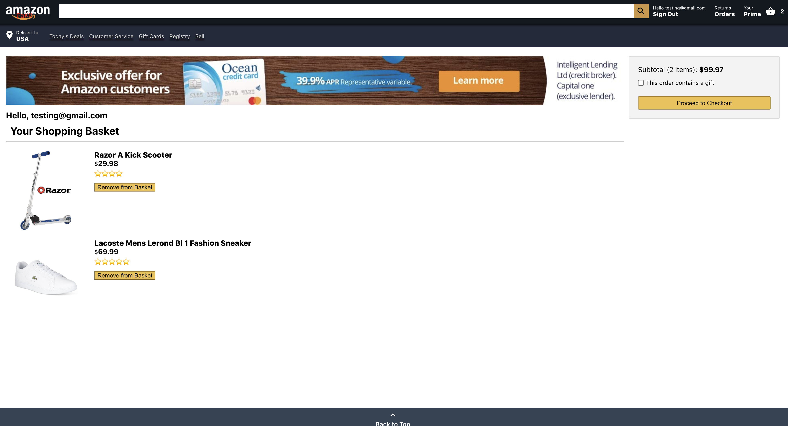
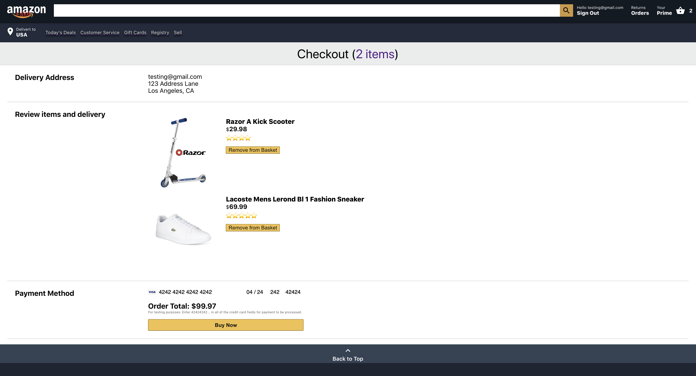
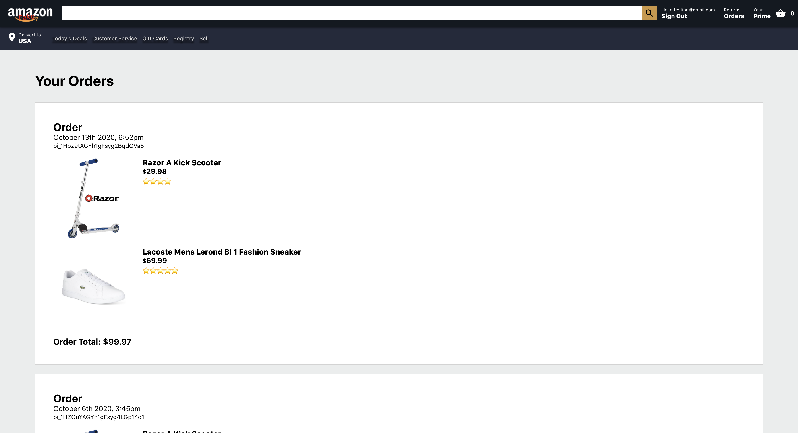
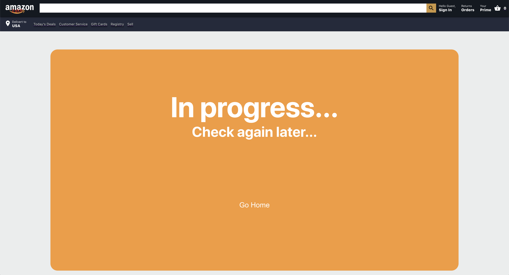

# **Amazon Mock UI**

### Click the link to view the website

[Amazon Mock UI Website](https://clone-ds.web.app/)

### About Us

##### Mock Amazon UI built utilizing React, Redux, SASS, and more. Deployed to Firebase utilizing Firebase database and user authentication. Backend built using Firebase and Axios.

##### Payment processing built using Stripe. You can see that some payments have been processed below in the payment processing screenshot.

###### For testing purposes: Enter 42424242... in all of the credit card fields for payment to be processed.

#### Project Work:

##### https://github.com/davesheinbein

#### LinkedIn:

##### https://www.linkedin.com/in/david-sheinbein/

## Screenshot:

[Home Page Sceenshot](https://imgur.com/GKAQjCW)

[Cart Page Sceenshot](https://imgur.com/0olVfsm)

[Checkout Page Sceenshot](https://imgur.com/AFKJ7Y0)

[Orders Page Sceenshot](https://imgur.com/eYjR2Iw)

[inProgress Page Sceenshot](https://imgur.com/Uwssfth)

[Login/SignUp Page Sceenshot](https://imgur.com/4kh8bTo)

[Stripe payments processed Sceenshot](https://imgur.com/reJKwYe)

[Stripe payments graph Sceenshot](https://imgur.com/qLxgK1X)

## Technologies Used:

##### 1. HTML5

##### 2. CSS

##### 3. Sass

##### 4. JavaScript

##### 5. Stripe

##### 6. Redux

##### 7. React

##### 8. Node.js

##### 9. Firebase

##### 10. Firebase Database

##### 11. Firebase Authentication

##### 12. CurrencyFormat

##### 13. Git

## Potential Next Steps:

##### - [X] Update CSS further to make responsive on all size screens

### Click the link to view David Sheinbeins Portfolio website

[David Sheinbein Portfolio Webstite](http://www.davidsheinbeinportfolio.com/)
